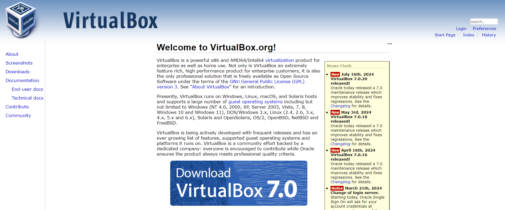
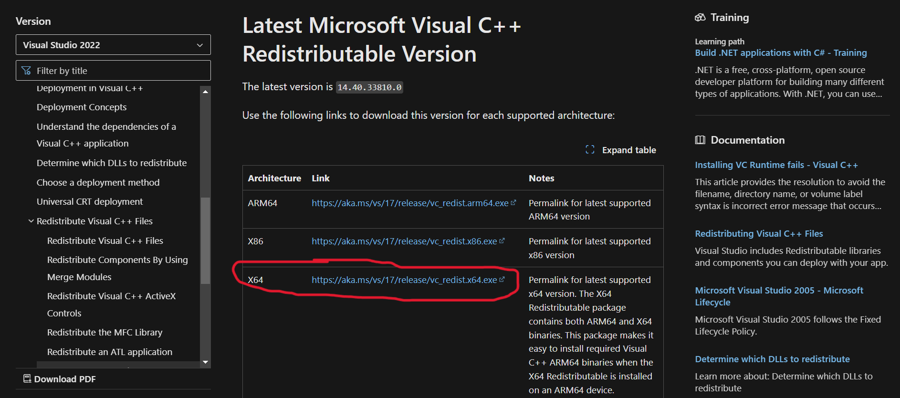
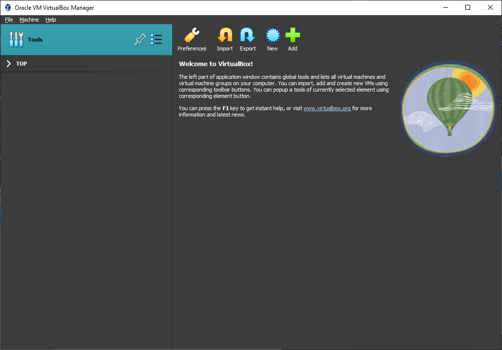
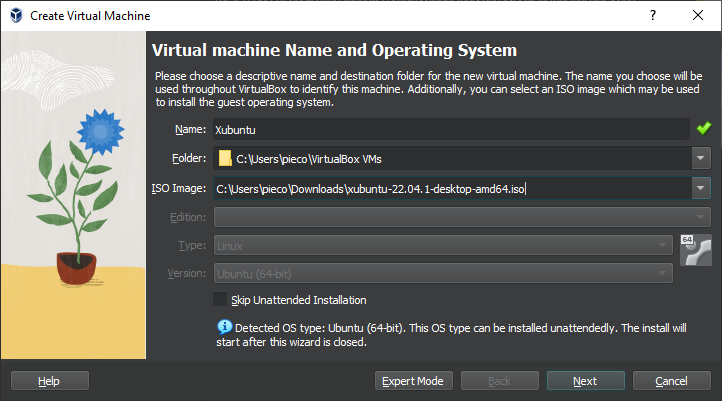
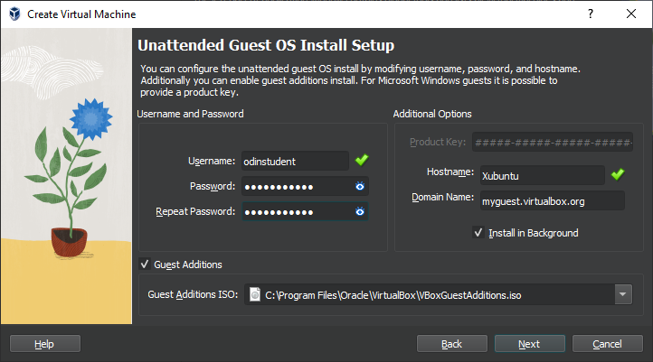
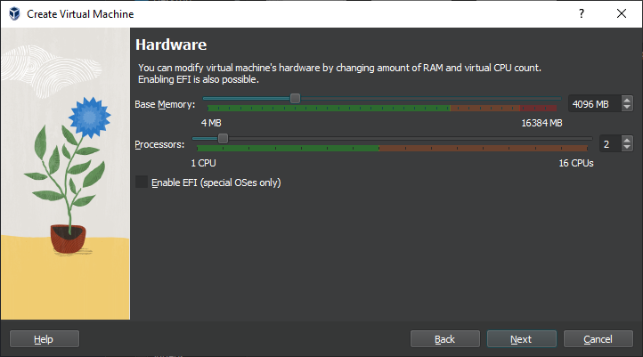
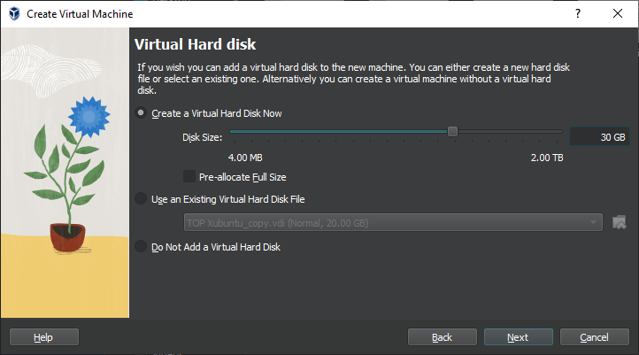
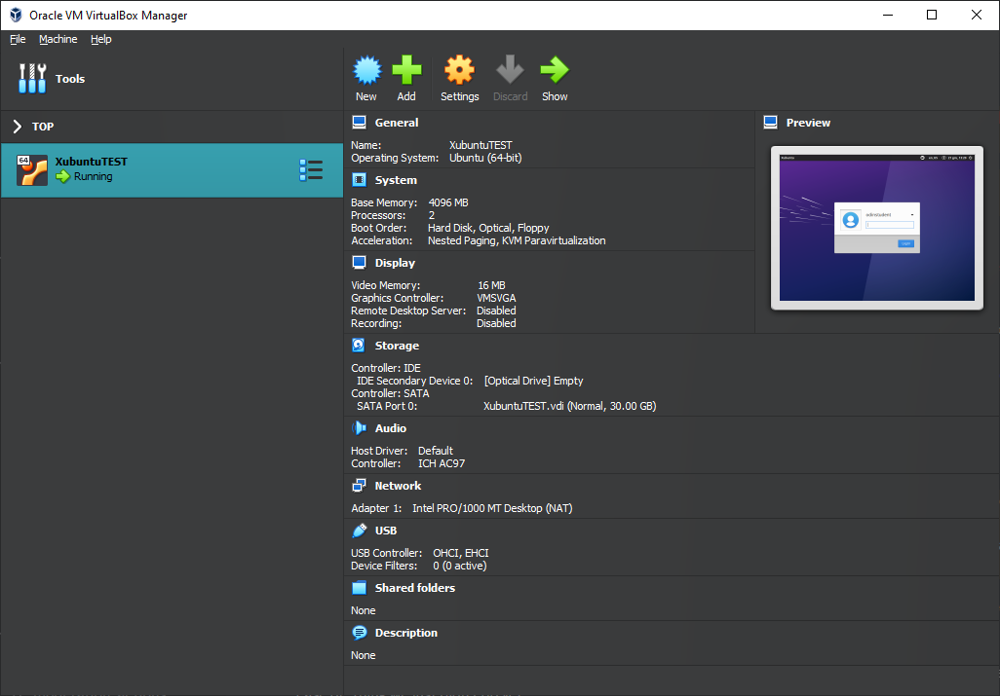
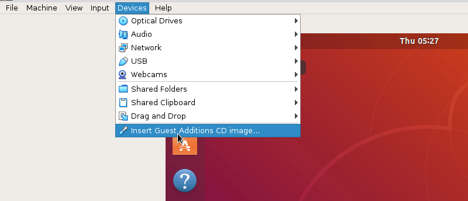

# Virtual Machine Install & Configuration

## Step by step guide on how to install and configure a virtual machine using Oracle VirtualBox

**Step 1: Download OS ISO File** \
Download the appropriate ISO file for the operating system you want to install on the virtual machine.

**Step 2: Download VirtualBox** \
Head over to the [VirtualBox](https://www.virtualbox.org) website to download. 

Once the download is complete, double click the downloaded VirtualBox file to start the installation process.

* Note: For Windows users, If you get an error about needing Microsoft Visual C++ 2019 Redistributable Package, \
  you can download it from the [Microsoft Learn website](https://learn.microsoft.com/en-us/cpp/windows/latest-supported-vc-redist?view=msvc-170#visual-studio-2015-2017-2019-and-2022).
  Most likely you will need the x64 version. \
  
  
**Step 3: Configure VirtualBox** \
Once you have VirtualBox installed, launch the program. 
* Click on the New button to create a virtual operating system

* Give it a name (Can be any name, but the name of your desired OS is recomended)
* In **ISO Image** choose Other - you’ll see a window open for you to find the .iso file of your OS that you downloaded earlier. \
  Leave the rest as it is, and Continue by pressing **Next**.

*  Set your **Username** and **Password**, and click the **Guest Additions** and **Install in Background** options. \
   Continue by pressing **Next**. 

  
*  In the **Hardware** section you should set your Base Memory to a minimum of 2048 MB (Max: half of your total RAM)
*  For **Processors** set it to be at least 2 (depends on your device capabilies, but 2 is standard). \
   Click **Next** to continue.

   
*  For the **Virtual Hard Disk** set it to at least 30 GB (Check online for the minimum storage needed for the OS that you will be using on the virtual machine).
   Click **Next** to continue.

   
*  On the next page (Summary page) you can click **Finish** to begin the installation process. you will know the installation is done when you see a login screen 
   in the preview area.
*  Click the green arrow called **Show** and you’ll be shown a virtual machine window and the login screen. Log in with the password you set up during the installation process.

*  Install VirtualBox Guest Additions (Optional but Recommended). Inside the virtual machine window, click on "Devices" in the menu bar and select "Insert Guest Additions CD image."
   Follow the prompts to install the Guest Additions for better performance.

